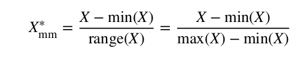
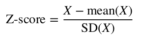
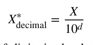
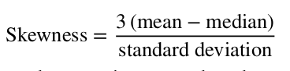
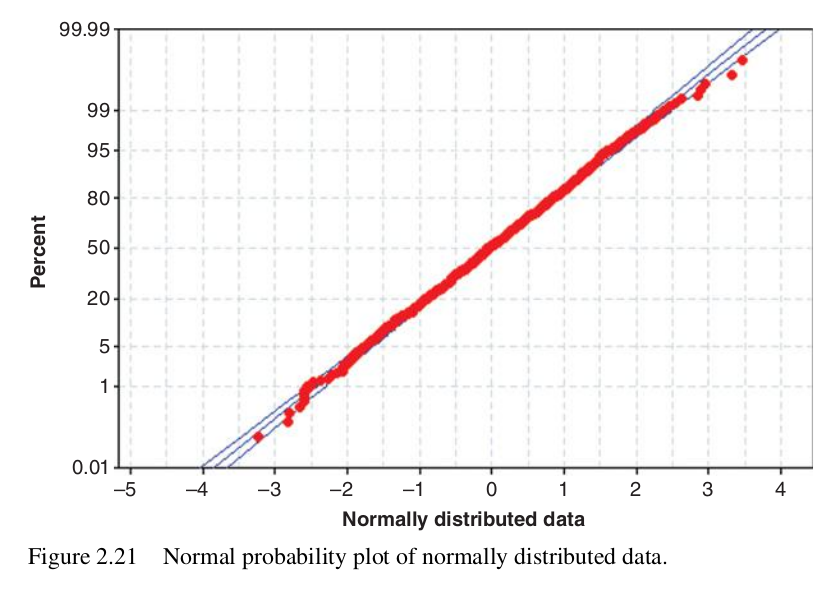
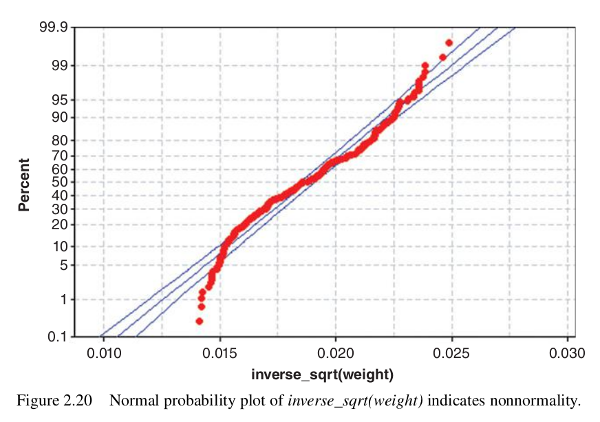
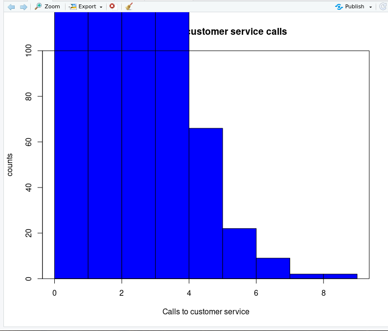
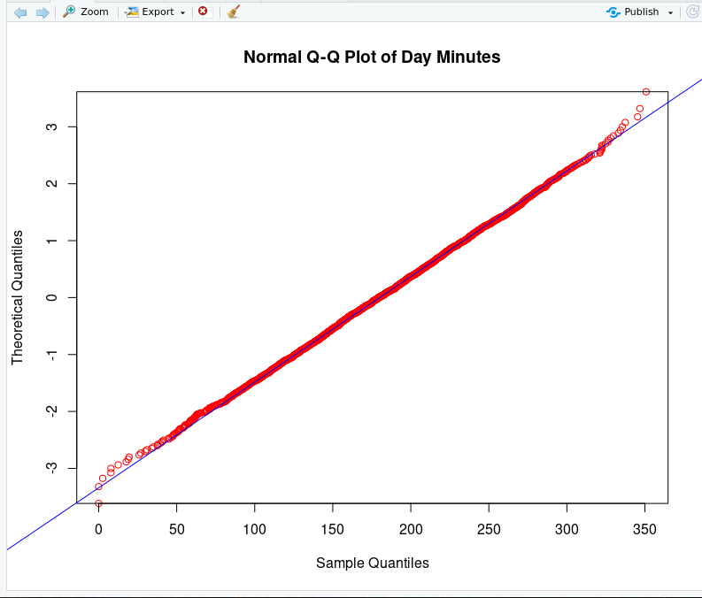
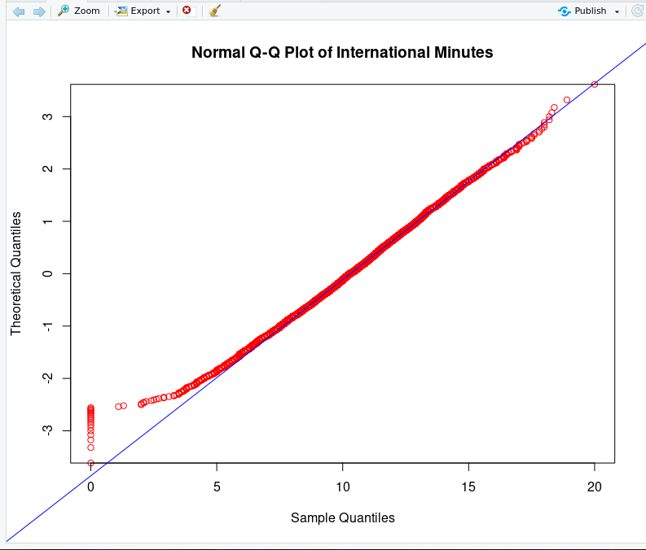
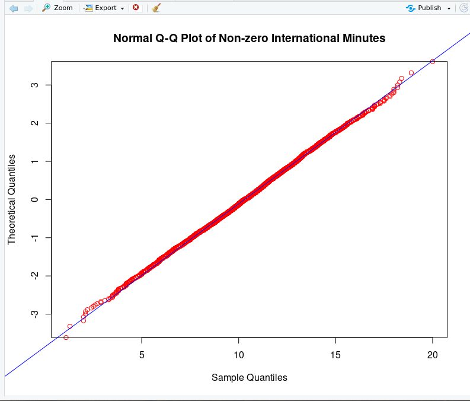

# Handling missing data

Records with missing data should not just be discarded (if 5% of data values are missing from a data set of 30 variables, almost 80% of records would have missing at least one missing value).

Typical methods:
1. Replace with constant
2. Replace with field mean (for numeric variables) or field mode (categorical variables)
3. Replace with randomly generated value from observed distribution of variable
4. Data imputation - coming up with a value which is likely based on the other available data for the record. For example in a data set with cars, a record has a missing value for the number of cylinders. If the car has 300 cubic inches and 150 hp, we would predict a different number of cylinders than for a car with 100 cubic inches and 100 hp.

# Outliers

- We can identify them graphically using a histogram
- Or using two dimensional scatter plots

# Measures of center and spread

- Mean, median, mode are measures of center, but they do not provide a complete picture alone, measures of spread are also important to more fully understand the nature of the data
- Measures of spread include the range, the interquartile range, and the standard deviation.
- Because different variables can have very different ranges, it is useful to normalize numeric variables, to make them more comparable.

## Normalization techniques

### Min-max normalization



This converts all values to a value between 0 (for the minimum) and 1 (for the maximum). The average of the minimum and maximum value (but not necessarily of the whole data set) would have a value of 0.5

### Z-score standardization



The Z-score is a measure of how many standard deviations away from the mean a certain value is. For example a Z-score of -1 indicates that the value is one standard deviation below the mean and a Z-score of 1 indiciates that the value is one standard deviation above the mean.

### Decimal scaling

Decimal scaling ensures that every normalized value lies between -1 and 1.  



## Transformation to achieve normality

To standardize our data, we often plot the Z-standardized version of our data. However, just using Z-standardization will not guarantee that the data will be normally distributed, it can still be *skewed*.



Right-skewed data (which occurs quite commonly) will have a positive skewness, wheareas left-skewed data will have a negative skewness.

In order to eliminate skewness, we can apply a transformation on the data. Common transformations include:
- natural log transformation
- square root transformation
- inverse square root transformation

One of the ways to evaluate whether our data is normally distributed is to construct a **normal probability** plot, which plots quintiles of a particular distirbution against the quintiles of the standard normal distribution (that's why it's sometimes also called a Q-Q plot). If the distribution is normal, the majority of the points will fall on the straight line:



For non-normally distributed data, the points will not fall on the straight line:




## Identifying outliers

There are two main numerical methods for identifying outliers:
1. The Z-score method
2. The interquartile range (IQR) method

### The Z-score method

Using the Z-score method, any value whose Z-score is greater than 3, or less than -3, is considered to be an outlier. 

However, a problem with the Z-score method is that the mean and standard deviation, which are part of Z-score standardization are both sensitive to the presence of outliers. For example if we have a very large value, this will increase the mean and increase the standard deviation, therefore making it less likely that the value will be classified as an outlier.

### The IQR method

To use the IQR method, we have to divide our data set into quartiles - four parts, each containing 25 percent of the values. The interquartile range is defined as `IQR = Q3-Q1`. Any value which is less than `Q1 - 1.5IQR` or greater than `Q3 + 1.5IQR` is then considerd to be an outlier.

# Assignment

Assumed setup:

`churn <- read.csv(file="./churn.txt", stringsAsFactors = FALSE)`

## 33.

There are no missing values for any of the variables

```
na_count <- sapply(churn, function(value) sum(length(which(is.na(value)))))
na_count <- data.frame(na_count)
na_count
```

## 34.

There are only three unique values for area code (408, 415, 510), but there are 51 unique values for states. This is either completely impossible (if USA has unique area codes in the whole country) or at least incredibly unlikely (if USA has unique area codes per state).

```
table(churn$State)
length(unique(churn$State))

table(churn$Area.Code)
length(unique(churn$Area.Code))

barplot(table(churn$State), las=2, cex.names=0.5)
barplot(table(churn$Area.Code))
```

## 35.

To graphically identify outliers, a histogram can be used.

```
par(mfrow=c(1, 1))
hist(churn$CustServ.Calls,
     breaks=10,
     col="blue",
     border="black",
     xlab="Calls to customer service",
     ylab="counts",
     main="Histogram of customer service calls")
box(which="plot", lty="solid", col="black")
summary(churn$CustServ.Calls)
```



In the histogram, we can see that there are are two people who made 9 calls to customer service. This could be considered an outlier, since the distribution is very left-skewed and these data points are all the way on the right on the graph, and there is only a very small number of them, compared to the total number of records.

## 36.

**IQR**
We can use the summary function to find the quartiles for the Customer calls variable:

```
summary(churn$CustServ.Calls)
```

This gives a Q1 of 1, and Q3 of 2. Therefore, the IQR is 1. Values are considered outliers if they are less than Q1 - 1.5IQR or more than Q3 + 1.5IQR. Because the number of customer calls cannot be negative, there are no outliers on the lower end. On the higher end, customers with 4 or more calls would be considered outliers.

**Z-score**

To find the range for outliers using the Z-score, we first need to get the mean and the standard deviation. The mean was given by the `summary` function above, it is 1.563. The standard deviation can be found using the `sd` function:

```
sd(churn$CustServ.calls)
```

The sd is 1.3155. Using the Z-score method, values are considered to be outliers if their Z-score is greater than 3 or less than -3. In other words, values which are further than 3 standard deviations away from the mean. For the lower end this would be 1.563 - 3(1.3155), which would give a negative value, just like the IQR method did. Therefore, there are again no outliers on the lower end. On the higher end, values greater than 1.563 + 3(1.3155) are considered to be outliers, so customers with 6 calls or more.

## 37.

```
zscore_day_mins <- ((churn$Day.Mins-mean(churn$Day.Mins))/sd(churn$Day.Mins))
zscore_day_mins
```

## 38.

### a)
```
day_mins_skew <- ((3*(mean(churn$Day.Mins) - median(churn$Day.Mins)))/sd(churn$Day.Mins))
```
The skewness of *day minutes* is 0.2066

### b)

```
zscore_day_mins_skew <- ((3*(mean(zscore_day_mins) - median(zscore_day_mins)))/sd(zscore_day_mins))
```
Where `zscore_day_mins` was obtained using the method in 37. The skewness of Z-score standardized *day minutes* is also 0.2066, the same as for regular *day minutes*. This is expected, Z-score standardization has no effect on skewness.

### c)

I would expect *day minutes* to be nearly perfectly symmetric, because the skewness is very close to zero, so the mean and the median are very close together, which is the case for symmetric distributions.

## 39

```
par(mfrow = c(1, 1))
qqnorm(churn$Day.Mins,
       datax=TRUE,
       col="red",
       main="Normal Q-Q Plot of Day Minutes")
qqline(churn$Day.Mins,
      col="blue",
      datax=TRUE)
```

*day minutes* is almost perfectly normally distributed, as the majority of the points on the normal probability plot are very close to the straight line. 



## 40

### a)
```
par(mfrow = c(1, 1))
qqnorm(churn$Intl.Mins,
       datax=TRUE,
       col="red",
       main="Normal Q-Q Plot of International Minutes")
qqline(churn$Intl.Mins,
       col="blue",
       datax=TRUE)
```


### b)

The distribution has a "fat left tail" - there are many more customers who have 0 international minutes than there would be if the data were normally distibuted. This can be confirmed using the `table()` function or a histogram of the variable.


### c)

```
churn["has_international_minutes"] <- unlist(lapply(churn$Intl.Mins, function(x) as.numeric(x > 0)))
```

### d)

```
churn["non_zero_international_minutes"] <-unlist(lapply(churn$Intl.Mins, function(x) if (x>0) x else NA))

par(mfrow = c(1, 1))
qqnorm(churn$non_zero_international_minutes,
       datax=TRUE,
       col="red",
       main="Normal Q-Q Plot of Non-zero International Minutes")
qqline(churn$Intl.Mins,
       col="blue",
       datax=TRUE)

```

The derived variable is much closer to a normal distribution than the original variable. By getting rid of the points near 0, there are now very few points which are not on the straight line of the normal probability plot.

